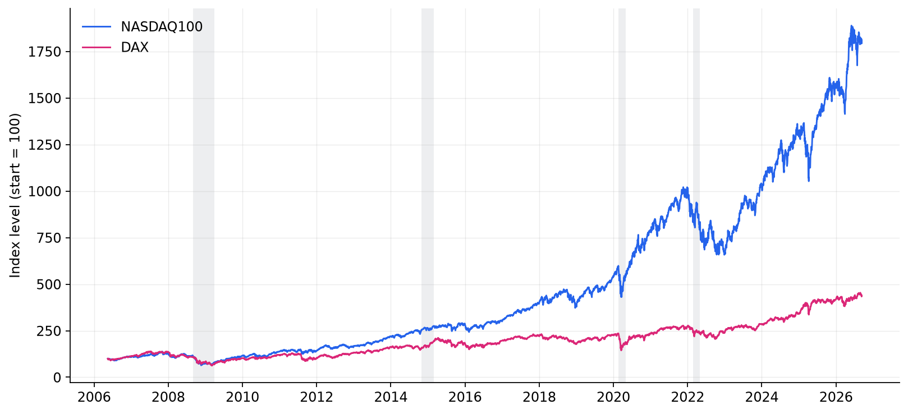
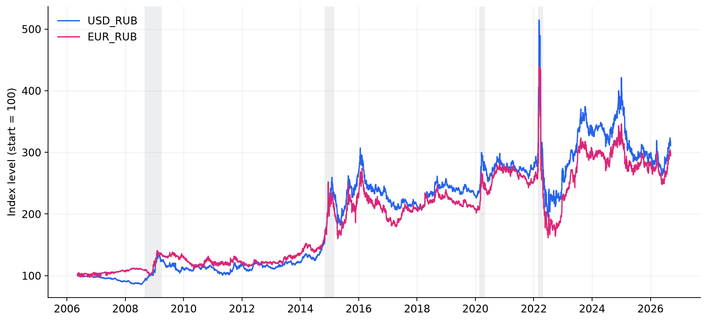
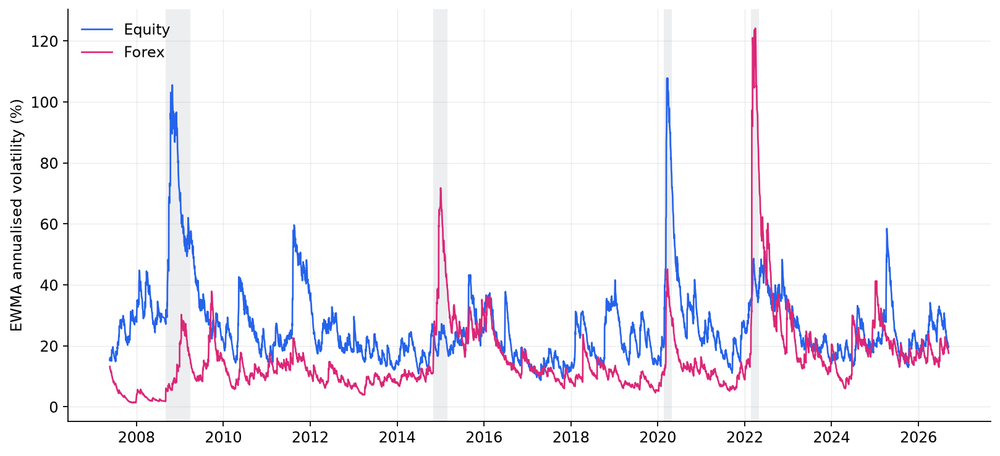
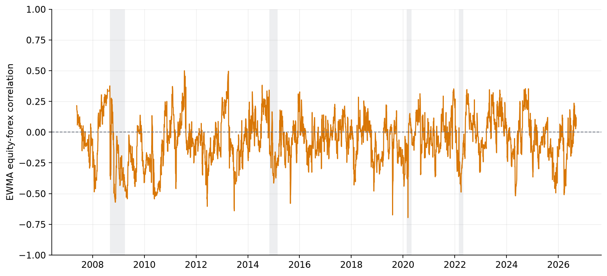
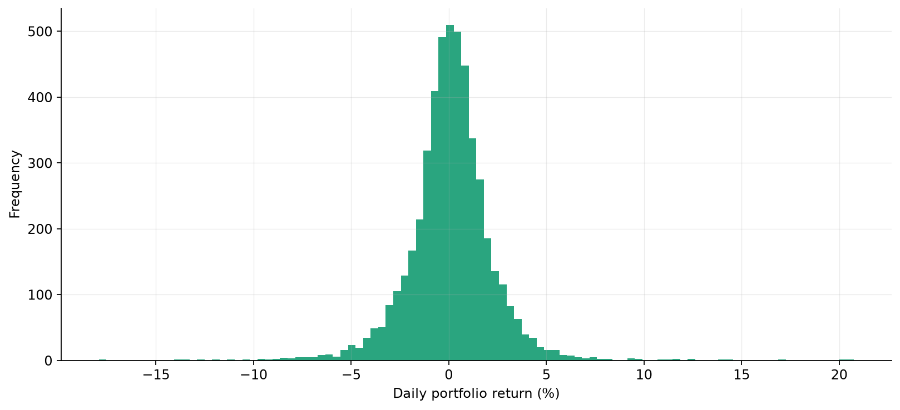
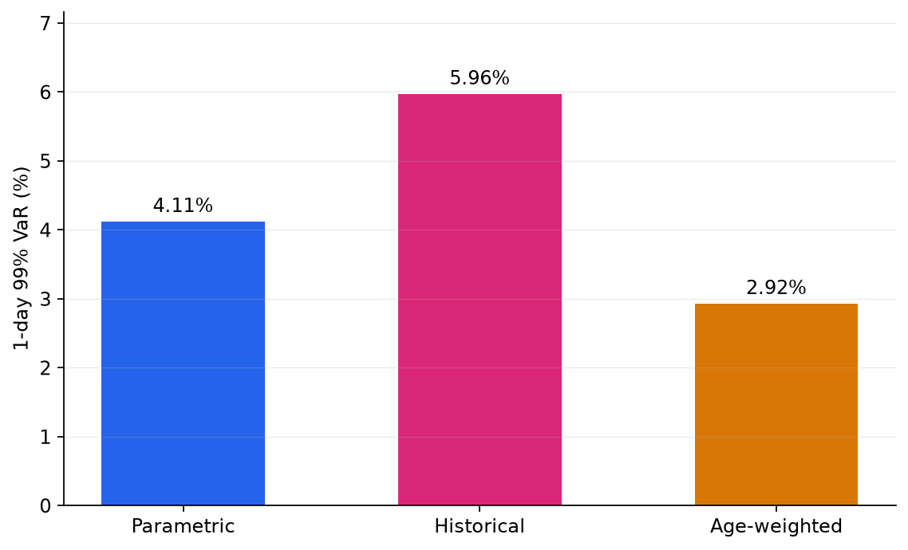

# Results

Every figure and number on this page is produced by `scripts/build_figures.py`, which
runs the package against the fetched dataset. Nothing here is hand-entered.

## Sample

| | |
|---|---|
| Period | 2006-05-17 → 2026-09-11 |
| Daily returns | 4,988 |
| EWMA decay (λ) | 0.94 |
| Confidence level | 99% (α = 0.01) |

## Market data

The NASDAQ 100 and DAX over the sample, rebased to 100. Shaded bands mark the four
crisis windows.

USD/RUB and EUR/RUB, rebased. Rising means a weakening ruble — note the step changes
in late 2014 and early 2022, both of which persist rather than reverting.

## Volatility

| | Mean | Peak | Peak date |
|---|---|---|---|
| Equity | 26.3% | 107.8% | 2020-03-19 |
| Forex | 15.8% | 124.2% | 2022-03-31 |

The headline result of the decomposition: **the two components peak in different
crises.** Equity volatility spikes in 2008 and again in the COVID crash. Currency
volatility barely reacts to either, then dominates in the 2014 ruble crisis and in
2022 — where it reaches a level equity volatility never touches anywhere in twenty
years.

An investor looking only at aggregate portfolio volatility would see two spikes and
conclude the portfolio has one risk driver that occasionally flares up. Splitting the
series shows it has two, and they fire on different events.

## Correlation

| Mean | Minimum | Maximum |
|---|---|---|
| −0.064 | −0.696 | +0.500 |

The correlation between equity and currency returns swings across most of the
available range. Averaging it to −0.06 and treating that as a constant would be
badly misleading: the series spends long stretches meaningfully negative — where
ruble depreciation cushions equity losses — and other stretches positive, where the
two risks compound instead.

This is what the parametric VaR calculation is picking up when it uses a
time-varying covariance matrix rather than a static one.

## Return distribution

Broadly bell-shaped with visibly fat tails on both sides. The fat tails are precisely
why the parametric and historical estimates below disagree: the normal distribution
assumed by the former does not have enough mass out where the losses actually are.

## Value-at-Risk

| Method | 1-day 99% VaR | 10-day |
|---|---|---|
| Parametric | 4.11% | 13.00% |
| Historical | 5.96% | 18.85% |
| Age-weighted | 2.92% | 9.24% |

Same portfolio, same data, same confidence level — and a spread of over three
percentage points.

The ordering is informative. **Historical is highest** because the twenty-year sample
contains crises far more severe than current conditions, and equal-weighting means
2008 counts as heavily as last month. **Age-weighted is lowest** because it discounts
those distant crises in favour of the recent, calmer regime. **Parametric sits
between**, driven by an EWMA covariance that reflects recent conditions but assumes
a thin-tailed normal distribution.

!!! note "Which is right?"
    None of them, individually. They answer slightly different questions — *what has
    happened*, *what is happening lately*, and *what the model says* — and the gap
    between them is itself the useful output: it measures how much the answer depends
    on that choice rather than on the data.

## Component risk

Setting the exposure vector to isolate each factor:

| Exposure | 1-day 99% VaR |
|---|---|
| Equity only | 2.90% |
| Forex only | 2.59% |
| Combined | 4.11% |
| Sum of stand-alone | 5.49% |
| **Diversification benefit** | **1.38%** |

The combined figure is 1.38 percentage points below the sum of the parts. That gap is
the diversification benefit, and it exists because the two risks are not perfectly
correlated — the same instability shown in the correlation chart above, now expressed
in units of risk.
